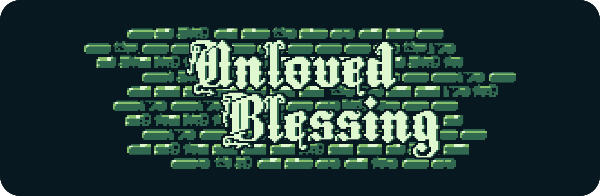
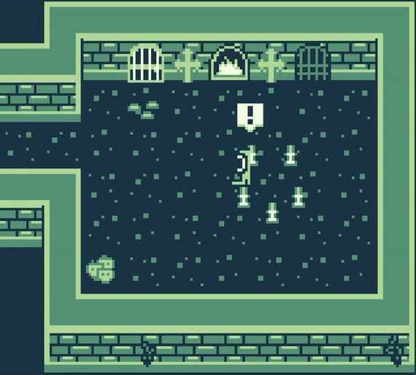
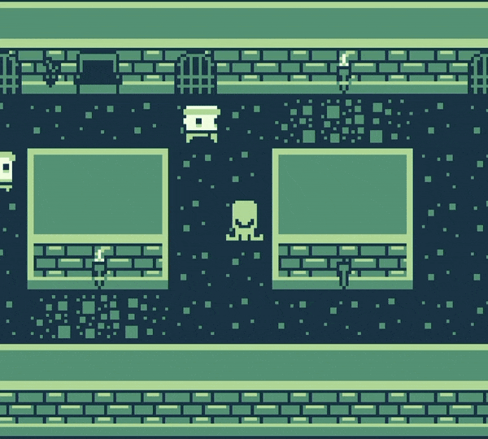

<p align="center">
  
</p>

[](https://javier-games.itch.io/unloved-blessing)
[](https://itch.io/jam/gbjam-12)

# Unloved Blessing

> Disclaimer
>
> This game contains elements of horror, psychological tension, and themes of religious and cosmic horror that may not be suitable for all audiences. *Unloved Blessing* does not refer to or represent any specific religion, and any resemblance is purely coincidental. If any player identifies with certain aspects, it is not intentional, and the game does not make references to any real-world religion on purpose.

2D top-down horror adventure where players take on the role of Oswald, a man transformed into a grotesque, tentacled creature by a dangerous cult that worships the outer god Yog-Sothoth. Captured by this deranged sect posing as a church, Oswald must navigate the twisted corridors of a medieval cathedral to uncover the horrific truth behind his transformation and the fate of his beloved wife, Theodora.

<p align="center">
  
  
  
</p>

# Features

## Stealth-Based Gameplay

Evade patrolling monks and cultists as you navigate through dark, eerie church corridors.

## Abilities

- 4 directions movement to hide from the enemies.
- Interact with objects to solve the puzzles.
- From behind of the enemies interact with them to use telepathic intimidation.

## Atmospheric Storytelling

Immerse yourself in a medieval world of religious corruption, cosmic horror, and tragic love. Discover the fate of Theodora as you uncover the cult's dark secrets. Your decisions affect the outcome of the game.

# Development

*Unloved Blessing* was created as a submission for the 12th edition of the [GBJAM](https://itch.io/jam/gbjam-12), a 10-day game jam celebrating GameBoy-inspired games. The jam ran from September 13th, 2024 at 8:00 PM to September 23rd, 2024 at 8:01 PM, and required all assets (except fonts) to be created within this time frame.

## Technical Restrictions

* **Resolution** : The game maintains the original GameBoy resolution of 160x144 pixels, scaled as needed but always respecting the aspect ratio.
* **Color Palette**: Only four colors are allowed on the screen at once. This rule applied to both sprites and backgrounds, without the use of transparency or extra colors.
* **No AI Tools**: All assets, from art to code, were created by humans during the jam. AI-generated art or code was not permitted.

## Game Jam Themes

### GameBoy

The game strictly adheres to the GameBoy theme, maintaining the original resolution, four-color palette, and control limitations while embracing the pixel art style iconic to GameBoy titles.

### Spooky

In line with the second theme, *Unloved Blessing* tells a dark, unsettling story involving cosmic horror, religious fanaticism, and body horror. The atmosphere of the game, along with its eerie art style and sound design, creates a genuinely spooky experience that aligns with the theme.

## Credits

* Music and Texts by **Akari Momose**
* Programming, Design and Story by **Javier García**

# Requirements

- [GB Studio 4.1.3](https://chrismaltby.itch.io/gb-studio)

## Assets Requirements

- [Tiled 1.11.0](https://www.mapeditor.org/) (Maps and Levels)
- [Affinity Photo 2 & Affinity Designer 2](https://affinity.serif.com/) (Graphics)
- [Carillon Editor (Hammer)](https://www.pouet.net/prod.php?which=17337) (Sound FX)

# Project Installation

## Run the Project

To run *Unloved Blessing* locally using GB Studio:

1. Clone the repository using the following command:
    ```bash
    git clone https://github.com/javier-games/jam-unloved-blessing
    ```
2. Open GB Studio and load the project by opening the `Unloved Blessing.gbsproj` file located in the root folder of the project.
3. To run the game within GB Studio, press the Play button located in the top-right corner of the editor.

## Deploy the Project

Once you are ready to export the game, follow these steps:

1. Locate the Export button within GB Studio.
2. Select one of the three available options for deployment:
    - Web
    - GameBoy ROM
    - Pocket (for Analogue Pocket)

### Web Deployment

1. Export the project as a Web version.
2. To run the web version locally, you’ll need to serve it using a local server. If you have Python installed, you can run a simple local server by navigating to the build/web directory and running the following command in the terminal:

    ```bash
    python -m http.server
    ```

3. This will launch the game in your web browser. Open your browser and go to [http://localhost:8000](http://localhost:8000) to play.

### ROM Deployment

You will need to use an emulator or flash the ROM onto a cartridge to play on original hardware. Recommended emulators for testing are [RetroArch](https://www.retroarch.com), [OpenEmu](https://openemu.org/), [ArcEmu](https://apps.apple.com/us/app/arcemu-watch-emulator/id6496282733) or [MiSTer FPGA](https://misteraddons.com/) (for a more hardware-accurate experience).

You can download one of these emulators and load the ROM file to start playing.

### Pocket Deployment

Follow the official instructions in the [Analogue Pocket](https://www.analogue.co/developer) docs to transfer the game and play it on the device.

# Play it Now!

If you’d rather skip the deployment process and dive right into the game, you can play it online directly through our official page on [itch.io](https://javier-games.itch.io/unloved-blessing). The web version is fully playable in your desktop or mobile browser. On the same page, you will find the latest releases, including the ROM for your favorite GameBoy emulator, the .Pocket version for Analogue Pocket, and the full soundtrack of *Unloved Blessing* available for download.


# License

This project is licensed under the GNU General Public License v3.0. See the [LICENSE](LICENSE.txt) file for details.
